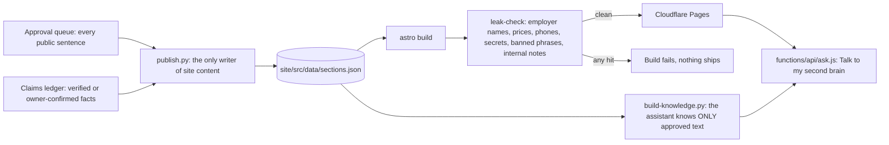

# rajranpariya.com: the site, its publication firewall, and Jarvis

The source of [rajranpariya.com](https://rajranpariya.com) and the small personal AI system around it. This is the actual code that runs; a few pattern lists that name private things (employers, phone numbers, a home address) are replaced with placeholders such as `employer-a` or `<phone-1>`, and the résumé source is left out because it names real employers. Everything else is verbatim.

Built by directing AI to implement, then verifying against the running system rather than trusting a report that says it works.

## What is in here

| Path | What it is |
|---|---|
| `site/` | Astro static site. Sections and cards render only from `src/data/sections.json`; unapproved slots render as "Coming soon". |
| `scripts/publish.py` + `test_publish.py` | The publication contract: a queue row can ship only if every claim it cites is verified, its text passes the leak patterns, and its target slot allows those claims. 20 tests. |
| `scripts/leak-check.sh` | The gate wired into `npm run build`. Scans source, built output, the functions and the PDF text. Fails the build on a hit; has a self-test that plants leaks. |
| `site/functions/api/ask.js` | The public assistant: Cloudflare Pages Function on Workers AI, same origin, no key, no third-party script. Pre-filters greetings, location, personal, build-detail and rule-changing questions; post-filters every answer with the gate's own patterns. |
| `scripts/build-knowledge.py` | Generates the assistant's entire world from approved slots only, plus the refusal regexes, at build time. `test_ask_filters.mjs` covers 32 cases. |
| `site/functions/_middleware.js` + `api/traffic.js` | Coarse visit records (country, region, city, user-agent family; no IP, no cookie) into KV; read back by the weekly traffic agent with a bearer secret. |
| `jarvis/gateway.py` | Text in, voice note out: local small-model summary, Piper text-to-speech, Telegram delivery through a dedicated bot; every brief audited to a JSONL file. |
| `jarvis/hooks/claude-stop-hook.py` | A Claude Code Stop hook that ships a finished session's final message to the gateway, fire-and-forget, throttled. |
| `jarvis/agents/` | The SEO audit agent (deterministic checks against the live site) and the weekly traffic report agent, plus their installer. |
| `scripts/render-resume.sh`, `render-og.sh` | Headless-Chrome renders of the résumé PDF and the link-preview card. |
| `projects/` | Write-ups of the personal AI projects on the site: market monitor, life admin, health routine. |

## Principles that the code enforces

- No public sentence without an approval row and a verified claim behind it.
- The build fails, rather than warns, on anything that must not ship.
- The assistant cannot leak what it does not know: its knowledge is generated from the approved text, and its answers are filtered again.
- Verification against the running system: the smoke checks, the self-test that plants leaks, the live tests of the assistant before every deploy.
